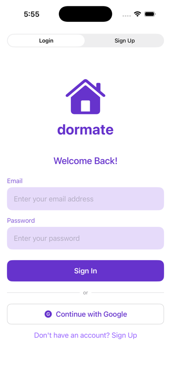
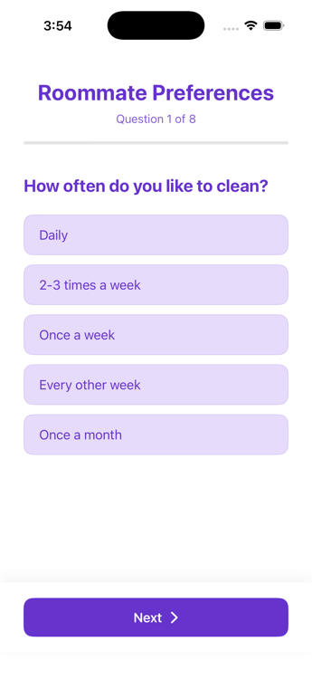
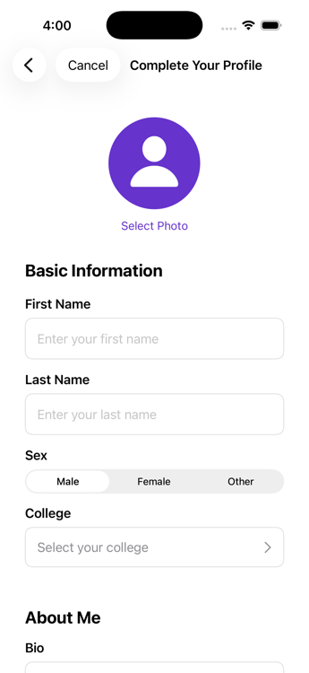

# Dormate

A roommate-matching iOS app for college students — think "dating app mechanics, but for finding someone you can actually live with."

> **Status: prototype.** Built in spring 2025 as a self-directed project to learn SwiftUI and Firebase end to end. It runs, but it was never shipped to the App Store — the code is here as a snapshot of the experiment. Revisited in 2026 to fix the auth/navigation flow and add Google Sign-In.

## How it works

1. **Sign up** with email or Google (Firebase Auth + Google Sign-In)
2. **Living survey** — 8 questions covering cleaning habits, chore style, bed/wake times, study location, social frequency, room temperature, and guest policy
3. **Profile setup** — name, bio, interests, photo, and your school picked from a searchable directory of US colleges (bundled CSV, searchable by name/city/state/zip/alias)
4. **Browse matches** — candidates are filtered to your college, and each one gets a **compatibility score**: living preferences are weighted ~60% (cleanliness, noise, sleep schedule, guests, smoking/drinking/pets, temperature) and shared interests ~40% (Jaccard similarity over interest tags)
5. **Match → chat** — liking someone updates both users' match lists in Firestore and auto-creates a chat thread with a welcome message; messaging is real-time

## Screenshots

| Login | Living survey | Profile setup |
|:---:|:---:|:---:|
|  |  |  |

## Tech

- **SwiftUI** throughout — TabView shell, NavigationStack flows, sheets for profile editing
- **Firebase** — Auth (email + Google), Firestore (users, matches, chats, messages), Storage (profile photos)
- **Google Sign-In** — ID-token exchange for a Firebase credential; first sign-in bootstraps the Firestore profile from the Google account
- App-state-driven routing: unauthenticated → survey → profile setup → main app, from a single `ContentView` switch

## Running it

You'd need your own Firebase project (`GoogleService-Info.plist` is gitignored, deliberately). Open `dormate2.xcodeproj`, drop in your plist, and run. But see status above — this is a prototype, not a product.

## What I learned / what I'd do differently

- **Matching logic lives client-side** in `MatchingService` — fine for a prototype, but scoring and mutual-match writes belong in Cloud Functions so users can't tamper with them and rules stay consistent
- **Firestore security rules** were never hardened beyond development mode — the first thing I'd fix before real users
- The survey→preferences mapping collapses answers into coarse 1–5 scales; with real usage data I'd rather learn weights than hand-tune them
- Same-college + same-sex hard filters were a v1 simplification; real matching needs proper filter options
- This was one of several iterations (earlier versions lived in separate repos) — the biggest lesson was scoping: v1 tried to be Tinder + a survey engine + a chat app at once
